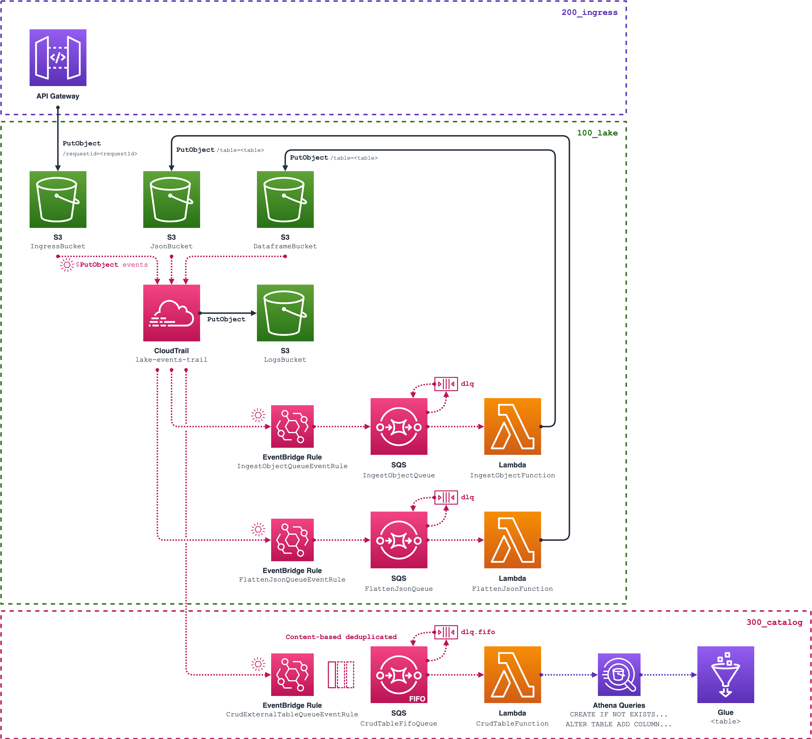

# Serverless dataplatform

## Getting started

*TODO*

### What you will find

- A (dead-easy) deployable data platform for you to deploy at no cost and play around with;

- Straight-forward options and template parameters to integrate the platform with your existing AWS resources, including re-using your existing KMS keys, AWS Cognito UserPool, AWS ApiGateway custom authorizers;

- *By-the-book* configurations of plenty of AWS Services, including examples for:
  - **AWS CloudWatch** log groups, content-based filtered events rules (**EventBridge**) & alarms;
  - KMS Encrypted **S3** buckets, configured with **AWS CloudTrail** logging, robust bucket policies;
  - KMS Encrypted standard and **FIFO SQS queues**, producers and consumers;
  - **AWS ApiGateway** exotic integrations (e.g. S3) and other hacks.

- **AWS Cloudformation** tips & tricks including Custom macros, resources & nested templates;

### Why

- **Fully serverless and cost efficient architecture design**

- **Highly available and scalable ingress system**

- **As less code as possible**

- **As agnostic as possible**

### Architecture overview



## Installation

### Software prerequisites

- **AWS CLI** (1.17.14+);
- **Python** (3.8.2+);
  - **boto3** (1.16.8+);
- **AWS SAM CLI** (0.47.0+).

### Troubleshooting / Limitations

- This project contains git submodules. Make sure to pull all submodules using `submodule update`:
  ```sh
  git submodule update --init --recursive
  ```

- The AWS SAM CLI has a [known limitation](https://github.com/aws/aws-sam-cli/issues/1470), being unable to properly build AWS Lambdas (and other Local File System builds) in nested applications.

### CloudFormation configuration

#### Required capabilities

- `CAPABILITY_NAMED_IAM`:
  These Cloudformation templates include resources that affect permissions in your AWS account (e.g. creating new AWS Identity and IAM users). You must explicitly acknowledge this by specifying this capability.

- `CAPABILITY_AUTO_EXPAND`:
  Some of these Cloudformation templates contain macros and Cloudformation nested applications. Macros perform custom processing on templates. You must acknowledge this capability.

#### Deploying the application

This assumes your AWS CLI environment is properly configured.

- From the project root directory, run the AWS SAM CLI to build and deploy the Cloudformation application. It is recommended to use the `--guided` option in order to configure the application deployment, including template parameters:

  ```sh
  sam build
  sam deploy --guided --capabilities "CAPABILITY_NAMED_IAM CAPABILITY_AUTO_EXPAND"
  ```

- You will be prompt with a selection menu, generating a configuration recap as follows:

  ```sh
  Deploying with following values
  ===============================
  Stack name                   : data-platform
  Region                       : eu-west-1
  Confirm changeset            : True
  Deployment s3 bucket         : <your_cfn_deployment_bucket>
  Capabilities                 : ["CAPABILITY_NAMED_IAM CAPABILITY_AUTO_EXPAND"]
  Parameter overrides          : {"EnableEncryption": "True", "KmsKeyArn": "NONE", "EnableApiAuthorization": "True", "ApiAuthorizerArn": "NONE"}
  Signing Profiles             : {}
  ```

- Deploy the application to your AWS account by confirming the Cloudformation changeset.

## Using the data platform

The data platform combine a number of AWS services, and can be integrated and used in a wild number of scenarios. The following examples shows some ways to start playing around and use some of its basic features, available out of the box.

### 1. Create a CognitoPool user and get your Authorization token

If you've configured the data platform application to enable `ApiAuthorization` and create its own Cognito UserPool, you will need to create a User and request an authorized token in order to use the data platform ingress API.

You may do so programmatically using the AWS CLI, as follows:

- **Get your UserPool id**. The data plaform's CognitoPool should be named `data_platform-user_pool`:

  ```sh
  USER_POOL_ID=`aws cognito-idp list-user-pools \
    --max-results 10 \
    --query 'UserPools[*].[Name, Id]' \
    --output 'text' | awk '/data_platform-user_pool/ { print $2 }'`
  echo 'UserPool id:' $USER_POOL_ID
  ```

- **Get your UserPool client id**. This is a client application declaration that provides a way to generate authentication tokens used to authorize a user, which has been created along with the user pool. It has been configured to use a Client Secret, along with various Auth flows:
  ```sh
  USER_POOL_CLIENT_ID=`aws cognito-idp list-user-pool-clients \
    --user-pool-id $USER_POOL_ID \
    --query 'UserPoolClients[0].ClientId' \
    --output 'text'`
  echo 'UserPool client id:' $USER_POOL_CLIENT_ID
  ```

- **Get your UserPool client secret**. This will used to generate a secret hash the UserPool client will verify when authenticating:
  ```sh
  USER_POOL_CLIENT_SECRET=`aws cognito-idp describe-user-pool-client \
    --user-pool-id $USER_POOL_ID \
    --client-id $USER_POOL_CLIENT_ID \
    --query 'UserPoolClient.ClientSecret' \
    --output 'text'`
  ```

- **Create a new UserPool user**. This requires to set a user temporary password, that the user will have to change, as we will do later on:

  ```sh
  USER_POOL_USER_NAME='user@example.com'
  USER_POOL_USER_PASSWORD=`uuidgen`

  aws cognito-idp admin-create-user \
    --user-pool-id $USER_POOL_ID \
    --username $USER_POOL_USER_NAME \
    --temporary-password $USER_POOL_USER_PASSWORD
  ```

- **Generate the UserPool user secret hash**, as explained above:
  ```sh
  USER_POOL_SECRET_HASH=`echo -n "$USER_POOL_USER_NAME$USER_POOL_CLIENT_ID" \
    | openssl dgst -sha256 -hmac $USER_POOL_CLIENT_SECRET \
    | xxd -r -p \
    | openssl base64`   
  ```

- **Authenticate to the UserPool** using all the credentials set above. Please note that the first authentication session will require an extra step as the user will have to change their password:
  ```sh
  USER_POOL_AUTH_SESSION=`aws cognito-idp admin-initiate-auth \
    --auth-flow 'ADMIN_NO_SRP_AUTH' \
    --user-pool-id $USER_POOL_ID \
    --client-id $USER_POOL_CLIENT_ID \
    --auth-parameters "USERNAME=$USER_POOL_USER_NAME,PASSWORD=$USER_POOL_USER_PASSWORD,SECRET_HASH=$USER_POOL_SECRET_HASH" \
    --query 'Session' \
    --output 'text'`
  ```

- **Set up a new password** and get your Authorization token:
  ```sh
  USER_POOL_USER_PASSWORD_NEW=`uuidgen`
  USER_POOL_AUTHORIZATION_TOKEN=`aws cognito-idp admin-respond-to-auth-challenge \
    --user-pool-id $USER_POOL_ID \
    --client-id $USER_POOL_CLIENT_ID \
    --session $USER_POOL_AUTH_SESSION \
    --challenge-name 'NEW_PASSWORD_REQUIRED' \
    --challenge-responses "NEW_PASSWORD=$USER_POOL_USER_PASSWORD_NEW,USERNAME=$USER_POOL_USER_NAME,SECRET_HASH=$USER_POOL_SECRET_HASH" \
    --query 'AuthenticationResult.IdToken' \
    --output 'text'`
  echo 'UserPool id token:' $USER_POOL_AUTHORIZATION_TOKEN
  ```

- **Your user is now fully set up.** Make sure to save the latest password you generated. Whenever you need a renewed Authorization token, you may use the following command:

```sh
USER_POOL_AUTHORIZATION_TOKEN=`aws cognito-idp admin-initiate-auth \
  --auth-flow 'ADMIN_NO_SRP_AUTH' \
  --user-pool-id $USER_POOL_ID \
  --client-id $USER_POOL_CLIENT_ID \
  --auth-parameters "USERNAME=$USER_POOL_USER_NAME,PASSWORD=$USER_POOL_USER_PASSWORD_NEW,SECRET_HASH=$USER_POOL_SECRET_HASH" \
  --query 'AuthenticationResult.IdToken' \
  --output 'text'`
echo 'UserPool id token:' $USER_POOL_AUTHORIZATION_TOKEN
```

This exampled showed how to programmatically change a UserPool user's password using the AWS CLI and an admin account. It is your responsibility to provide your user with a proper way of authenticating.

### 2. Publish a document to the data platform

The data platform bundles an ApiGateway endpoint which proxies and directly integrates with S3, to provide a very reliable way of ingesting data at high speed and volume (Please refer to the [Ingress API README](./310-ingress/README.md) for more details).

You may do so programmatically using the AWS CLI, as follows:

- Get your ingress API endpoint:
  ```sh
  INGRESS_API_AWS_REGION=`aws configure get region`
  INGRESS_API_ID=`aws apigateway get-rest-apis \
    --query 'items[*].[name,id]' \
    --output 'text'| awk '/data_platform-ingress/ { print $2 }'`
  INGRESS_API_ENDPOINT="https://$INGRESS_API_ID.execute-api.$INGRESS_API_AWS_REGION.amazonaws.com/main"
  echo 'Ingress API endpoint:' $INGRESS_API_ENDPOINT
  ```

- You can publish JSON data to any table in your data platform using the `POST /table/<tableName>/object`. Make sure the `Content-Type` header of your request is set.

  If you've enabled the `ApiAuthorization`, make sure to pass the required authorization info to your API authorizer (if using the custom data platform's Cognito UserPool, copy your token obtained above in the Authorization header).

  The following will POST a new document to the `myTable` table:
  ```sh
  curl -d '{"key1":"value1", "key2":"value2"}' \
    -H 'Content-Type: application/json' \
    -H "Authorization: $USER_POOL_AUTHORIZATION_TOKEN" \
    -X 'POST' \
    "$INGRESS_API_ENDPOINT/table/myTable/object"
  ```

- If everything goes to plan, the API should return a `200 OK` response, containing a JSON encoded body as follows, meaning that the document has properly been copied to the ingress bucket, and will be running though the platform:
  ```json
  { "success": true, "data": { "id": "e7439ba1-e646-4aad-a18a-e7c381202721" } }
  ```

- The `data.id` field corresponds to a unique AWS request id which will allow you to track your file throughout the platform.

  As for example above, checking the data platform's lake ingress S3 bucket, you will see that the document has been saved to key `id=e7439ba1-e646-4aad-a18a-e7c381202721`, and its destination table and request-time have been saved as object metadata:
  ```sh
  INGRESS_AWS_ACCOUNT_ID=`aws sts get-caller-identity \
    --query 'Account' \
    --output 'text'`

  aws s3api head-object \
    --bucket "$INGRESS_AWS_ACCOUNT_ID-lake-ingress" \
    --key 'id=e7439ba1-e646-4aad-a18a-e7c381202721' \
    --query '[ContentType,Metadata]'

  [
      "text/plain;base64",
      {
          "request-time": "27/Feb/2021:16:17:38 +0000",
          "table": "myTable"
      }
  ]
  ```

  The document has been saved base64-encoded. The [lake functions](./210-lake-functions/README.md) functions will then take over and:
    - Validate the document type;
    - Normalize the document structure to be easily parsable in AWS Athena.

### 3. Explore your documents' transformation stages

*TODO*

### 4. Query your documents with Athena

*TODO*

## Contributing

All contributions are welcome! Depending on your interest and skill, you can help build and maintain the different parts of the project:

**Improve on the resources configuration**

Make pull requests, report bugs and misconfigurations of resources,

**Start open discussions**

Feel free to contact me, discuss of questionnable architecture design pattern, and share ideas on how this data platform framework could be improved.
